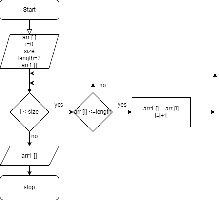

# Необходимо решить следующую задачу:
"Написать программу, которая из имеющегося массива строк формирует новый массив из строк, длина которых меньше, либо равна 3 символам. Первоначальный массив можно ввести с клавиатуры, либо задать на старте выполнения алгоритма. При решении не рекомендуется пользоваться коллекциями, лучше обойтись исключительно массивами."

**1. Нарисовать блок-схему алгоритма (можно обойтись блок-схемой основной содержательной части, если вы выделяете её в отдельный метод)**

**2. Снабдить репозиторий оформленным текстовым описанием решения**
* Ввод элементов массива;
* Вывод получившегося массива на экран;
* Необходимо сравнить, не превышает ли длина каждого элемента массива 3;
* Элементы длина которых меньше или равна 3 вывести на экран.

**3. Написать программу, решающую поставленную задачу**

string[] Array() {
    string[] array = new string[4];
    
    Console.WriteLine("Задайте элементы массива:");
    for (int i=0; i < 4; i++){
        Console.Write("array[{0}] = ", i);
        array[i] = Console.ReadLine();
    }        
    return array;
    
}

void ShowArray(string[] array){
    string final = " ";
    int j = 0;
    Console.Write("[ ");
    for(int i=0; i<array.Length; i++){
        Console.Write(array[i] + " , ");
        if (array[i].Length <= 3){
            final = final + array[i] + ", ";
            j++;
        } 
    }
    Console.Write("]");
    Console.Write(" => ");
    Console.Write("[" + final + "]");
    Console.WriteLine(" ");
}

ShowArray(Array());